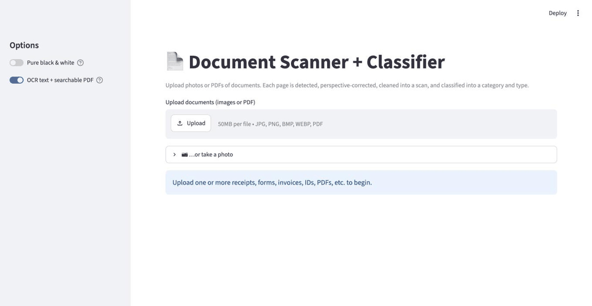
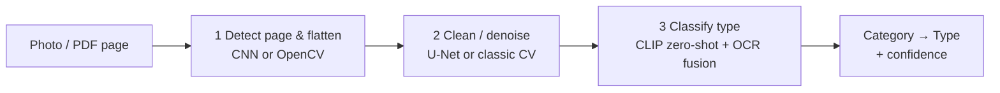
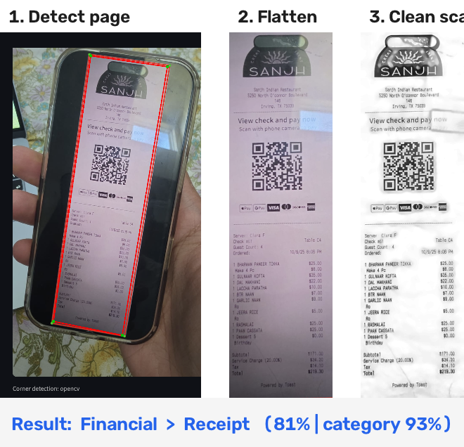

# 📄 Document Scanner + Classifier

Turn a **photo or PDF of a document** into a clean, flattened scan **and** predict
what kind of document it is — across an **8-category, 43-type** taxonomy
(receipt, invoice, cheque, prescription, shipping label, transcript, ID, …).

[](https://github.com/visheshbhargava0811/document-classification/actions/workflows/ci.yml)
[](LICENSE)




It grew out of a deep-learning course project (corner detection + dewarping +
denoising) and adds a document-type classifier plus a real, runnable app — a
**Streamlit web UI**, a **`docscan` CLI**, and a **Python API**.

## ✨ Features

- **Scan** — detect the page, perspective-correct it, and clean it into a crisp
  grayscale (or black-and-white) scan.
- **Classify** — hierarchical zero-shot classification into a **category** and a
  specific **type**, with a confidence-aware "type uncertain → trust the
  category" fallback.
- **CLIP + OCR fusion** — keyword signals sharpen visually-similar types
  (Invoice vs Bill vs Purchase Order, Cheque, Payslip, Menu…).
- **Inputs** — images *and* multi-page PDFs, single or **batch**, plus **camera
  capture** in the web app.
- **Exports** — cleaned PNG, **searchable PDF** (invisible OCR text layer),
  extracted text, JSON, and a batch **ZIP**.
- **No training required** — CLIP zero-shot + classic-CV fallbacks; optional
  trained weights load as a drop-in upgrade.

## 🔧 How it works





1. **Dewarp** — finds the document's four corners and perspective-corrects it.
   Uses the trained `DocumentCornerModel` CNN if `dl_project_doc_extract_weights.pt`
   is present; otherwise a robust **OpenCV contour** detector.
2. **Denoise / enhance** — background/illumination division removes tint and
   shadows for a clean scan; uses the trained `Unet` if `model.pt` is present.
3. **Classify** — **CLIP zero-shot** over the taxonomy, aggregated to a category
   first (robust) then the best type within it, with **OCR keyword fusion** and an
   uncertainty flag. Falls back to a pure OCR heuristic fully offline.

> The `.pt` model weights are **optional** — the app is fully functional without
> them thanks to the classic-CV fallbacks. Drop the trained weight files into the
> project root (or a `weights/` folder) to use the neural versions; the
> architectures match the originals so the files load as-is.

## 🚀 Live demo

Deployed on Streamlit Community Cloud: **https://&lt;your-app&gt;.streamlit.app**
_(replace with your URL after connecting the repo — see [Deploy](#-deploy))._

## 📦 Install

Requires Python 3.11–3.13 and [uv](https://docs.astral.sh/uv/).

```bash
uv sync                # core app
uv sync --extra ocr    # + Tesseract OCR (searchable-PDF/text export & fusion)
```

The OCR features need the `tesseract` binary: `brew install tesseract` (macOS) or
`apt-get install tesseract-ocr` (Debian/Ubuntu).

## 🖥️ Usage

### Web app

```bash
uv run document-classification-web      # then open http://localhost:8501
```

Upload images or PDFs (or use the camera), then see the detected page, the
flattened image, the cleaned scan, the predicted category + type, and download
buttons (PNG / searchable PDF / text / JSON, plus a ZIP for batches).

### Command line

```bash
uv run docscan photo.jpg                       # single image
uv run docscan scans/ report.pdf --json        # a folder + a PDF, JSON output
uv run docscan photo.jpg --searchable-pdf --text
uv run docscan photo.jpg --bw                  # hard black & white scan
```

### Python API

```python
from document_classification import process_path

r = process_path("photo.jpg")
print(r.category, r.doc_type, r.confidence)   # e.g. "Financial" "Receipt" 0.81
print(r.uncertain, r.display_type)            # confidence-aware label
# r.flattened / r.cleaned are numpy images; r.classification has top-k
```

## 🗂️ Document types recognized

Each result reports both the **category** and the specific **type**:

- **Financial** — Invoice, Receipt, Bill, Bank Statement, Cheque, Tax Document, Payslip
- **Business** — Purchase Order, Quotation, Contract, Report, Business Card, Resume / CV, Spreadsheet / Table
- **Government / Identity** — Passport, Driver License, ID Card, Government Form
- **Healthcare** — Prescription, Medical Bill, Lab Report, Medical Form
- **Logistics** — Shipping Label, Packing Slip, Delivery Note, Waybill
- **Education** — Exam, Assignment, Notes, Transcript, Certificate
- **Forms** — Application, Registration, Survey, Checklist
- **General** — Letter, Newspaper, Book, Menu, Flyer, Handwritten Note, Photograph, Other

Edit the `TAXONOMY` tree in `src/document_classification/classify.py` to add or
remove categories and types — no retraining needed (zero-shot). Broad categories
are reliable; **fine-grained distinctions within a category are heuristic**.

## 📊 Evaluation

A small, honest accuracy check on a **curated** labelled set (a regression guard,
not a public benchmark):

```bash
uv run python eval/evaluate.py          # full pipeline
uv run python eval/evaluate.py --raw    # classify raw images (faster)
```

Reports top-1 category and type accuracy and writes a category confusion matrix.
See [`eval/README.md`](eval/README.md) for how to drop in labelled images.

## ☁️ Deploy

Deploy to [Streamlit Community Cloud](https://streamlit.io/cloud):

1. Push this repo to GitHub.
2. On Streamlit Cloud, **New app** → pick the repo, set **Main file path** to
   `streamlit_app.py`.
3. Dependencies come from `requirements.txt` (CPU-only torch to stay small) and
   `packages.txt` (`tesseract-ocr`).

> **Memory note:** torch + CLIP can approach Cloud's memory ceiling. The app
> loads the model once (`@st.cache_resource` / cached text embeddings) and
> **degrades to the OCR classifier** if the model can't load. If it still OOMs,
> deploy to **Hugging Face Spaces** (more RAM) — the app is host-agnostic.

## 🧪 Development

```bash
uv sync --extra ocr
uv run pytest -q          # 24 tests (fast, offline)
uv run ruff check src tests
```

## 🏗️ Project layout

```
src/document_classification/
  models.py     # DocumentCornerModel (CNN) + Unet — match the original notebooks
  dewarp.py     # stage 1: corner detection (CNN / OpenCV) + perspective warp
  denoise.py    # stage 2: U-Net / classic enhancement (illumination division)
  classify.py   # stage 3: CLIP zero-shot + OCR fusion + hierarchical inference
  exports.py    # OCR text + searchable-PDF export
  pipeline.py   # orchestration -> ScanResult; image/PDF loading
  cli.py        # `docscan` command
  app.py        # Streamlit web UI
  web.py        # launcher for the web command
eval/           # curated accuracy harness + confusion matrix
tests/          # pytest suite
```

The original research notebooks (`project_*.ipynb`) and report remain in the
repo for reference.

## 📝 Notes

- First run downloads the CLIP model (`openai/clip-vit-base-patch32`, ~600 MB),
  cached afterwards.
- Classification quality is best on a clearly framed document; the CLIP labels
  are heuristic, not a guarantee — this is not an ATS or compliance tool.

## License

[MIT](LICENSE)
